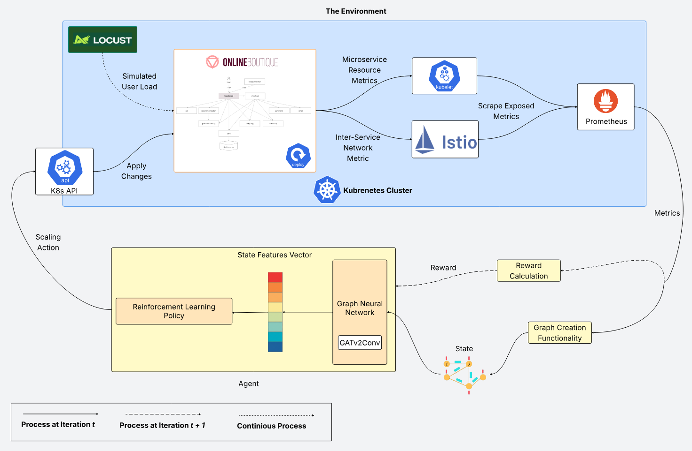

<h1 align="center">Graph‑RL Autoscaler: GNN‑Driven Agent for Cluster‑Based Microservice Scaling</h1>

<div align="center">
  <a href="https://github.com/SlyPex/graph-gym-hpa/actions"></a>
  <a href="https://github.com/SlyPex/graph-gym-hpa/commits/"></a>
  <a href="https://github.com/SlyPex/graph-gym-hpa/README.md#collaborators"></a>
  <a href="./LICENSE.md"></a>
  <br/>
  <a href="https://www.python.org/"></a>
  <a href="https://kubernetes.io/"></a>
  <a href="https://locust.io/"></a>
  <br/>
  <a href="https://prometheus.io/"></a>
  <a href="https://istio.io/"></a>

</div>

## Description 📝

### Introduction
Current autoscalers (e.g., the Kubernetes HPA) are mostly reactive and do not account for inter-service dependencies. To address this limitation, this project combines two complementary ideas:

- Reinforcement Learning: allows an agent to learn by interacting with a real-world environment, mainly a Kubernetes cluster.
- Graph Neural Networks: because microservices and their call relationships form a graph, GNNs are well suited to model and learn inter-service dependencies.


### Prerequisites 📋

Before starting, ensure you have:

- Active Kubernetes cluster **(v1.30+)**
- Python installed **(v3.11+)**
- Storage Requirements:

  - **~7GB** for python packages and dependencies
  - **~25MB per model checkpoint** (Checkpoints saved every N steps)
  - **Minimum of 15GB free disk space** recommended

### Cluster Stack 🏗️
<div align="center">
    
    <p>Figure: Shows the training loop of the agent and its interaction with the environment</p>
</div>


<div align="center">
  
|Tool|Utility
|:-:|:-:|
| <a href="https://kubernetes.io/"></a> | Container Orchestration |
| <a href="https://locust.io/"></a> | User Load Simulation |
| <a href="https://github.com/GoogleCloudPlatform/microservices-demo/tree/main"></a> | Benchmark Application |
| <a href="https://istio.io/"></a> | Injects a proxy at the pod level to monitor traffic between services |
| <a href="https://prometheus.io/"></a>| Gathers metrics from different deployed tools (istio, locust, onlineboutique) |

</div>

### Project Files 📂
```
├── k8s_config_files
│   ├── locust_files
│   │   ├── Dockerfile
│   │   ├── locustfile.py
│   │   └── locust.yaml
│   ├── onlineboutique.yaml
│   └── prometheus.yaml
├── results
│   ├── runs/
│   │   └── <run_name>/
│   │       ├── models/
│   │       ├── run.log
│   │       └── results.csv
│   └── tensorboard/
├── requirements.txt
├── setup.py
└── src
  ├── gym_hpa
  │   ├── gnn
  │   │   ├── gnn.py
  │   │   └── graphCreation.py
  │   ├── paths.py
  │   └── rl_environments
  │       ├── deployment.py
  │       ├── online_boutique.py
  │       └── util.py
  └── policies
      ├── run
      │   └── run.py
      └── util
            └── util.py
```

- `k8s_config_files`: A configuration files directory in order to properly deploy the cluster stack.
- `results`: A directory where the outputs of a training are saved (eg: Training Logs, Episode Metrics).
- `requirements.txt`: A generated file from `pip-compile` command provided by the `pip-tools` package, which contains the required modules in order to run this project.
- `setup.py`: A Python script used to describe a package (metadata, dependencies, packaging instructions) in our case, the local package .
- `src`: Holds the whole codebase of the developed framework.

  - `gym_hpa`:
    - `gnn`: the  and the  code is under this directory.
    - `rl_environments`: Holds the logic of handling the  app and its interaction with the K8s cluster.

  - `policies/run` : The main start point of this project to start a training/testing of an agent.

## Usage 🚀
The following steps require files from this repository. First, clone the project and access the directory:
  - ```bash
    git clone https://github.com/SlyPex/graph-gym-hpa.git
    ```
  - ```bash
    cd graph-gym-hpa/
    ```

### Cluster Setup 🛠️

Our cluster consists of the following VMs (Nodes):

- One Masternode (10 CPU Cores, 10 GB of RAM)
- Two Workers (8 CPU Cores, 8 GB of RAM)

> [!IMPORTANT]
> The following steps assume an existing Kubernetes cluster has already been set up, the previous specs and the setup method (kubeadm, Minikube, kind, etc.) is irrelevant, just make sure that the given resources (CPU Cores, RAM) to the cluster are more than enough to handle the previous stack.

1. Start by installing  using `istioctl` command line tool, follow the steps at 
2. Deploy prometheus using the file 
- ```bash
  kubectl apply -f k8s_config_files/prometheus.yaml
  ```
> [!NOTE]
> This  file should work out-of-the-box with istio, because it's the same file from the addons provided by istio project with some minor changes :
> 
> - Number of replicas is set to 2 to assure high availability
> - Added a prometheus service of type NodePort to ensure the continuous connectivity with prometheus API.
> - Changed Prometheus to scrape and aggregate metrics at the service level instead of the pod level to reduce scrape target cardinality and lower RAM usage. (RAM usage plateaus around 3.7 GB and stabilizes at about 1.8 GB)
3. Deploy the benchmark application Online Boutique:
- Create a new namespace named `onlineboutique`
  - ```bash
    kubectl create ns onlineboutique 
    ```
- Label the newly created namespace so that istio can inject the sidecars
  - ```bash
    kubectl label namespace onlineboutique istio-injection=enabled
    ``` 
- Finally, deploy the application using the file 
  - ```bash
    kubectl apply -n onlineboutique -f k8s_config_files/onlineboutique.yaml
    ```
4. Deploy locust the load generator via this file 
  - ```bash
    kubectl apply -f k8s_config_files/locust_files/locust.yaml
    ```
  > [!NOTE]
  > Locust pod runs two containers, Locust v2.10.2 and a locust-exporter that exposes metrics to (such as latency, avg response time) Prometheus ,
  > The exporter requires Locust v2.10.2, which is why we use that version
  > <br/>
  > Locust load generation is implemented in the  file which is also packed within a docker image using the ,
  > In case of any changes needed you can adjust these files to your need and use your custom docker image by setting this  with your built image, e.g. `ghcr.io/<org>/locust:vX.Y.Z`.

> [!CAUTION]
> All the yaml files used to deploy the previous stack have a `nodeAffinity` that prevents their deployments from being scheduled on the control-plane node (masternode VM), This may cause issues in some setups; please double-check that the nodeAffinity meets your cluster topology.

### Agent Setup & Training 🧠

> [!IMPORTANT]
> **Before Training - Critical Setup:**
> 1. **Kubernetes API Access**: Ensure the Kubernetes API is accessible from your training machine
>    - Set up kubectl proxy if needed: `kubectl proxy --port=8080`
>    - Update `HOST` in [`deployment.py`](./src/gym_hpa/rl_environments/deployment.py#L12) if using a different endpoint
>    - See [Kubernetes API Access Guide](https://kubernetes.io/docs/tasks/administer-cluster/access-cluster-api/)
> 
> 2. **Prometheus Accessibility**: Verify Prometheus is reachable at `localhost:31090`
>    ```bash
>    kubectl get svc -n istio-system prometheus
>    curl http://localhost:31090/-/healthy
>    ```
>    - If you modified the NodePort in [`prometheus.yaml`](./k8s_config_files/prometheus.yaml), update `PROMETHEUS_URL` in:
>      - [`util.py`](./src/gym_hpa/rl_environments/util.py#L7)
>      - [`graphCreation.py`](./src/gym_hpa/gnn/graphCreation.py#L54)

1. Install the required packages listed under the file   and the local package  in order to run the framework
  - ```
    pip install -r requirements.txt && pip install -e .
    ```
2. Change the directory to where the `run.py` script is:
  - ```
    cd src/policies/run
    ```
3. Finally, launch a training
  - ```
    python run.py --training --total_steps 1000 --alg a2c
    ```
    
> [!TIP]
> **Available Options:** Run `python run.py -h` (or `--help`) to list all the available options and their possible values.
> 
> **Monitor Resources:** Keep an eye on CPU and RAM usage to avoid OOM (Out of Memory) errors:
> ```bash
> # Monitor node resources
> kubectl top nodes
> 
> # Monitor pods sorted by memory (all namespaces)
> kubectl top pods -A --sort-by=memory
> 
> # Monitor pods sorted by CPU (all namespaces)
> kubectl top pods -A --sort-by=cpu
> 
> # Watch resources in real-time
> watch -n 2 'kubectl top nodes && echo && kubectl top pods -A --sort-by=memory'
> ```

## License 📄
This project is a derivative work of [Gym-HPA](https://github.com/jpedro1992/gym-hpa) and is licensed for 
**non-commercial educational and research use only**. 

See [LICENSE.md](./LICENSE.md) for complete terms.

For commercial use, contact:
- Original work: Ghent University & IMEC (info@imec.be)
- This fork: (s.meharzi@esi-sba.dz)


## Collaborators 🤝

<div align="center">
  <table border="0" cellpadding="0" cellspacing="0">
  <tr>
    <td align="center" valign="top" width="120">
      <a href="https://github.com/SlyPex">
        
        <br />
        <sub><b>Slimane MEHARZI (SlyPex)</b></sub>
      </a>
    </td>
    <td align="center" valign="top" width="120">
      <a href="https://github.com/fellahmohamed">
        
        <br />
        <sub><b>Mohamed Amine FELLAH</b></sub>
      </a>
    </td>
    <td align="center" valign="top" width="120">
      <a href="https://github.com/malkiAbdelhamid/">
        
        <br />
        <sub><b>Abdelhamid MALKI</b></sub>
      </a>
    </td>
  </tr>
  </table>
</div>
